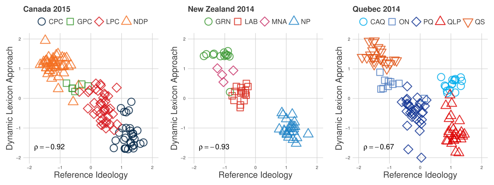

# Introduction to Data Science

Why do citizens vote? Does ideology matter?  How do citizens form their political opinions? Do social media platforms polarize the electorate? How do misinformation and social media shape political attitudes and behaviours?

These are some of the central questions driving contemporary research in political science and the study of public opinion. Answering them today requires not only strong theoretical foundations but also the ability to collect, manage, and analyze increasingly complex forms of data, from surveys and administrative records to social media streams and digital traces of behaviour.

/// caption
Comparison of Estimated Ideological Positions Using Digital Trace Data, [Temporão et al., 2018](https://www.cambridge.org/core/journals/political-analysis/article/ideological-scaling-of-social-media-users-a-dynamic-lexicon-approach/0173A3145A67CB89ACFC8DE09B30C482)
///

!!! note inline end "Instructor"
     - :material-account-circle: [Mickael Temporão](https://ent.sciencespobordeaux.fr/fr/annuaire/t/e/m/uduser-temporao-mickael-fr.html)
         - :fontawesome-brands-github: [@mickaeltemporao](https://github.com/mickaeltemporao)
     - :octicons-home-24: ScPoBx, B.140
     - :fontawesome-regular-calendar-check: [**Sign up for a meeting**](https://calendar.app.google/gC9dJNLrdZY7pWax6)

Beyond academia, companies, governments, and non-profits have also invested heavily in data science to understand their audience. In many ways, data scientists in these institutions are applied social scientists, drawing on the same set of methods you will learn in this course—from statistical modeling to text and network analysis.

This course introduces the core concepts, methods, and tools of data science for social scientists. We will explore how to formulate research questions in ways that leverage new data sources, how to process and visualize data to generate insights, and how to apply computational approaches (e.g. text analysis, network analysis, machine learning) to better understand public opinion and political behaviour. Our focus will be on linking methods to substantive questions, ensuring that the use of data science serves theory-driven and policy-relevant research.

## License

Science should be open, and this course builds up other open licensed material. Unless otherwise noted, all materials for this class are licensed under the [Creative Commons Attribution 4.0 International License](http://creativecommons.org/licenses/by-nc-sa/4.0/).

The source code and the materials to build this website can be found on [:fontawesome-brands-github: GitHub](https://github.com/mickaeltemporao/data-science).

## Feedback

If you have suggestions, find a typo, or any other issue on this website, please go to [issues](https://github.com/mickaeltemporao/data-science/issues), click on the "New Issue" button to create a new issue, and describe the problem.

