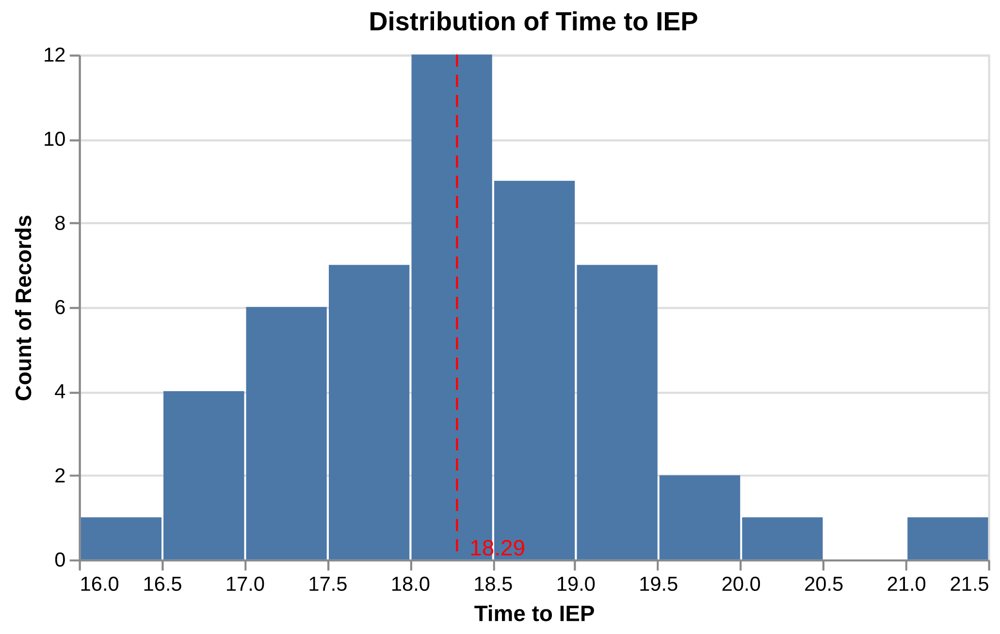

# Modeling Your Data


/// caption
///

## Overview

This module introduces the fundamental concepts of **statistical modeling** in political science research. We have already explored our data, visualized distributions, and examined relationships between variables. Now, we ask:

* How can we formalize patterns in data?
* How can we make confident claims that go beyond mere observation?

Modeling is the bridge between **descriptive insights** and **data-driven inference**. It allows us to quantify uncertainty, test hypotheses, and predict outcomes. Think of models as tools that help you reason rigorously about your data instead of relying solely on intuition.

!!! tip inline end "Learning Objectives"

    - Understand what a statistical model is and why it matters
    - Visualize data distributions and summary statistics in a modeling context
    - Learn how to interpret model-based estimates
    - Recognize common modeling pitfalls
    - Build confidence in data-driven claims

By the end of this module, you will have a conceptual understanding of modeling and practical skills to begin building your first models using Python.


#### Common pitfalls to avoid

- Modeling before understanding distributions
- Assuming linear relationships without evidence
- Misinterpreting statistical significance

## What is a Model?

A **model** is a simplified representation of reality that allows us to:

1. Summarize relationships between variables
2. Estimate effects while accounting for uncertainty
3. Make predictions for new data

For example, let's say we recorded the time I take to come to the IEP. You might first ask: *What is the actual time I take to come to work?* 

{ width=80% .center }
/// caption
///

### Modeling with Words

Even without code, practice **conceptual modeling**:

1. Identify your outcome variable (dependent variable) - Y (here it's `time_to_iep`)
2. Identify potential predictors (independent variables) - Xs
3. Ask: *How do other predictors explain variation in outcomes?*

> Conceptual modeling is essential before jumping to formulas. Models without theory are often misleading.


{ width=100% .center }
/// caption
///

#### Code to reproduce the figure

```python
# pip install "altair[all]"
import altair as alt
import pandas as pd

alt.renderers.enable("browser")

df = pd.DataFrame(
    {
        'time_to_iep': [
            16.93, 19.49, 18.21, 19.09, 17.67, 18.48, 16.37, 17.57, 19.18,
            18.74, 17.15, 17.76, 17.2, 19.78, 18.34, 17.93, 18.09, 17.14,
            19.41, 17.99, 16.54, 18.42, 16.65, 19.83, 18.32, 18.13, 16.72,
            18.05, 18.5, 19.45, 17.22, 17.32, 19.48, 18.93, 18.69, 18.78,
            18.58, 18.8, 18.28, 20.06, 18.12, 18.64, 18.16, 17.44, 18.96,
            17.55, 19.09, 17.95, 21.01, 18.19
        ]
    }
)

mean_val = df["time_to_iep"].mean()

hist = alt.Chart(df, title="Distribution of Time to IEP").mark_bar().encode(
    x=alt.X("time_to_iep:Q", bin=alt.Bin(maxbins=10), title="Time to IEP"),
    y="count()"
)

mean_line = alt.Chart(pd.DataFrame({"x":[mean_val]})).mark_rule(
    color="red", strokeDash=[6,4]
).encode(x="x:Q")

mean_text = alt.Chart(pd.DataFrame({"x":[mean_val]})).mark_text(
    text=f"{mean_val:.2f}",
    dx=20, dy=250, color="red"
).encode(x="x:Q", y=alt.value(0))

hist + mean_line + mean_text
```

## Hack Time

During hack time, we will work from **Notebook 7**. 

!!! tip inline end
    To load and use a notebook in VS Code, follow steps 3 to 5 in
    [📘 Notebooks in VS Code](../resources/notebook-vscode.md)

- Focus on *understanding how each predictor (IVs) helps understanding the outcome (DV)* you are trying to explain. Ask yourself:
    - How does this variable improve our ability to explain our outcome (DV) ?
    - Does it reveal patterns or relationships that were hidden before?

---

## Additional Resources

* [Altair User Guide](https://altair-viz.github.io/)
* [Pandas User Guide](https://pandas.pydata.org/docs/user_guide/index.html)
* [Linear Regression](https://www.statsmodels.org/stable/regression.html)

